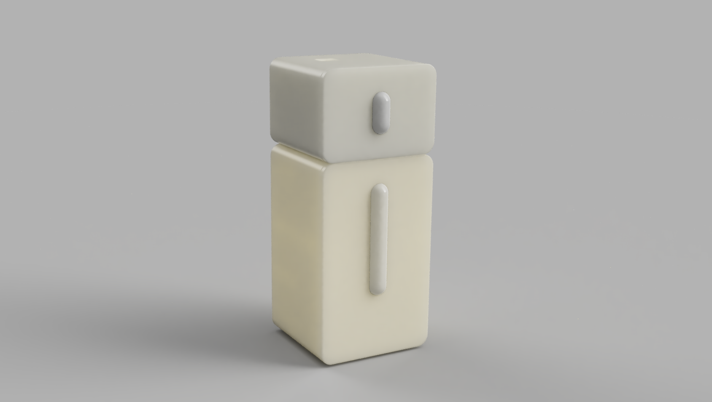
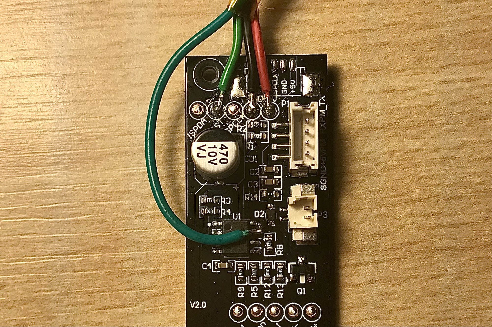

# ESP32 HomeKit Air Quality Sensor
Native Apple HomeKit via ESP32 for the IKEA VINDRIKTNING PM2.5 Air Quality sensor + MH-Z19B CO2 Sensor

The modification doesn't interfere with the VINDRIKTNING device itself. It just reads out data and passes it to HomeKit using ESP32.

This Firmware is a Frankenstein Monster built of some other IKEA VINDRIKTNING projects from kasik96, Hypfer and ESP32 HomeKit implementation from HomeSpan.

_As usual, don't expect any warranties. I am just a hobbyist, not a professional. It works for me, but you take your own risk using it. I am not liable for any damage to your devices._

I also added the MH-Z19B CO2 Sensor, which fits into the second enclosure along with a custom PCB, which can be glued (taped) on top of the VINDRIKTNING device. It follows the existing design and should look nice (I hope). It also has an LED to show the current CO2 level.



## Prerequisites

- ESP-32-WROOM with project PCB
- MH-Z19B CO2 sensor
- 1 NeoPixel LED
- Some short cables
- A soldering iron
- A long PH0 Screwdriver
- Some more components (check the [BOM](https://github.com/oleksiikutuzov/esp32-homekit-air-quality/blob/main/hardware/BOM.txt))

Everything we need from the IKEA sensor is accessible via easy-to-solder test points or microcontroller pins.

## Hardware
### VINDRIKTNING

To reach the original PCB from IKEA, we need to unscrew the four visible screws in the back of the enclosure.



As you can see in this image, you'll need to solder wires to GND (black), 5V (red), and the Testpoint that is connected to TX of the
Particle Sensor (lighter green). Additionally, you need to solder the cable to one of the pins of the microcontroller (darker green) to be able to read the values from the built-in light sensor. On my PCB I am using a JST-GH (1.25 mm) connector to connect all the wires from VINDRIKTNING. Make sure the cables from IKEA PCB have enough cross-section to carry the current, cause generic Chinese JST-GH connectors' cables are too thin. You can also connect them directly to GND, VIN (5V), and D2 (if you're using a Wemos D1 Mini). However, the light sensor is analog and outputs 0-5V. ADC pin of ESP32 can only read values in the range 0-1V, so you'll need to add a simple voltage divider to read out a voltage in the required range.

Solder the custom PCB, install the MH-Z19B CO2 sensor, connect the VINDRIKTNING board and NeoPixel LED via JST connectors and you are done.

### Sensor
The PCB has pads for 1.25 mm keyless 3-pin and 4-pin JST connectors, the lid has 4 mm holes for M3 threaded inserts and holes for small screws to fix the plate on which NeoPixel is mounted.

## Software

Here you can see, which pins are used and pre-defined in the firmware:
```c++
*				╔═════════════════════════════╗
*				║┌─┬─┐  ┌──┐  ┌─┐			  ║
*				║│ | └──┘  └──┘ |			  ║
*				║│ |            |			  ║
*				╠═════════════════════════════╣
*			+++ ║GND         			   GND║ +++
*			+++ ║3.3V      			   	  IO23║ USED_FOR_NOTHING
*				║     			    	  IO22║
*				║IO36    				   IO1║ TX
*				║IO39   				   IO3║ RX
*		 	    ║IO34      	  		      IO21║
*				║IO35     			    	  ║ NC
*		RED_LED ║IO32     				  IO19║ MHZ TX
*				║IO33     			      IO18║ MHZ RX
*  LIGHT_SENSOR ║IO25      			       IO5║
*	 LED_YELLOW ║IO26     			      IO17║
*				║IO27     			      IO16║ NEOPIXEL
*  VINDRIKTNING ║IO14    				   IO4║
*				║IO12      		  	       IO0║ +++, BUTTON
*				╚═════════════════════════════╝
```

The firmware can be built and flashed using the Arduino IDE.

For this, you will need to add ESP32 support to it.

Furthermore, you will also need to install the following libraries using the Library Manager:

* Adafruit NeoPixel
* HomeSpan
* EspSoftwareSerial

And some libraries manually:

1. Go to this GitHub repo and download it as a ZIP - [AsyncElegantOTA](https://github.com/ayushsharma82/AsyncElegantOTA)
2. In Arduino IDE select "Sketch" -> "Include Library" and "Add .ZIP Library..." and select downloaded ZIP
3. Do previous steps to the following libraries: 
   * [ESPAsyncWebServer](https://github.com/me-no-dev/ESPAsyncWebServer)
   * [AsyncTCP](https://github.com/me-no-dev/AsyncTCP)
   * [ErriezMHZ19B](https://github.com/Erriez/ErriezMHZ19B)
4. Download and open this repository in Arduino IDE (or VSCode with Arduino extension)
5. Set the upload speed to 115200
6. Build, flash, and you're done

Instead of Arduino IDE OTA, the webserver update was implemented. You can flash binary at `http://[DEVICE IP]/update`.
There is a reboot link. Opening `http://[DEVICE IP]/reboot` will force the device to reboot. 

The device can also be controlled by the button on the backside. More on [HomeSpan docs](https://github.com/HomeSpan/HomeSpan/blob/master/docs/UserGuide.md)

A list of settings variables is in the sketch. You can adjust the values up to your needs.

## Connect to HomeKit

1. Plug your Air Quality sensor to power (ESP32 is powered through VINDRIKTNING).
2. Press the button on the backside until the LED starts blinking rapidly and release it. Now it is in the configuration mode (More on [HomeSpan docs](https://github.com/HomeSpan/HomeSpan/blob/master/docs/UserGuide.md)). Press it two more times until the LED starts blinking 3 times in a row. This means mode 3 is chosen. Hold the button for 3-4 seconds once again and the WiFi AP will be started.
3. Go to WiFi settings on your iPhone/iPad and connect to the "HomeSpan-Setup" WiFi network.
4. You will choose your WiFi network and set the setup code for the accessory. 
5. Go to your Home app and select "Add Accessory"
6. Select "More Options" and you should see your Air Quality Sensor there.

## Prometheus metrics

The firmware creates a simple HTTP server to share the metrics to the Prometheus host server. The update interval is 10 seconds, the same as for the HomeKit data. Is available at the `http://[DEVICE IP]/metrics` default port is `80`.

## References and sources

- @kasik96 for HomeKit ESP8266 VINDRIKTNING custom firmware [GitHub link](https://github.com/kasik96/esp8266-vindriktning-particle-sensor-homekit)
- @Hypfer for MQTT ESP8266 VINDRIKTNING custom firmware [GitHub link](https://github.com/Hypfer/esp8266-vindriktning-particle-sensor)
- @HomeSpan for ESP32 HomeKit firmware [GitHub link](https://github.com/HomeSpan/HomeSpan)
- @Erriez for MH-Z19B CO2 sensor library [GitHub link](https://github.com/Erriez/ErriezMHZ19B)
- [@haxfleisch](https://twitter.com/haxfleisch) for their teardown of the device.
